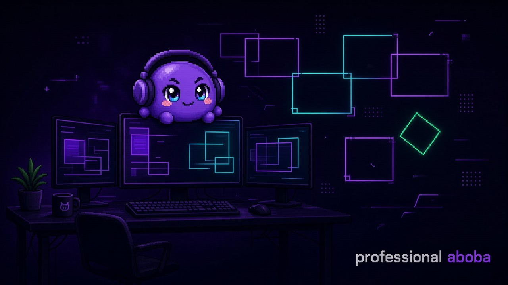

<div align="center">



<br/>


# aboba

**professional aboba · accidental maintainer · yes this is the brand**

[](https://github.com/AbobaAI?tab=followers)
[](https://omarchy.org/)
[](#)

</div>

---

### about

i break my desktop until it looks intentional.  
then i package the chaos so friends can install it in one command.


### stuff i actually pushed

| | |
|:--|:--|
| **[omarchy-firefox-start](https://github.com/AbobaAI/omarchy-firefox-start)** | firefox start page that pretends to be part of the OS (pixel fox included) |
| **[keysmith-ru](https://github.com/AbobaAI/keysmith-ru)** | keysmith, but it speaks russian and understands йцукен |

```bash
# start page
git clone https://github.com/AbobaAI/omarchy-firefox-start.git && cd omarchy-firefox-start && ./install.sh

# hotkeys (ru)
git clone https://github.com/AbobaAI/keysmith-ru.git && cd keysmith-ru && ./install-ru.sh
```

### currently

- collecting the title **professional aboba**

---

<div align="center">
<sub>zagreb timezone · powered by caffeine and hyprland · aboba rights reserved</sub>
</div>
